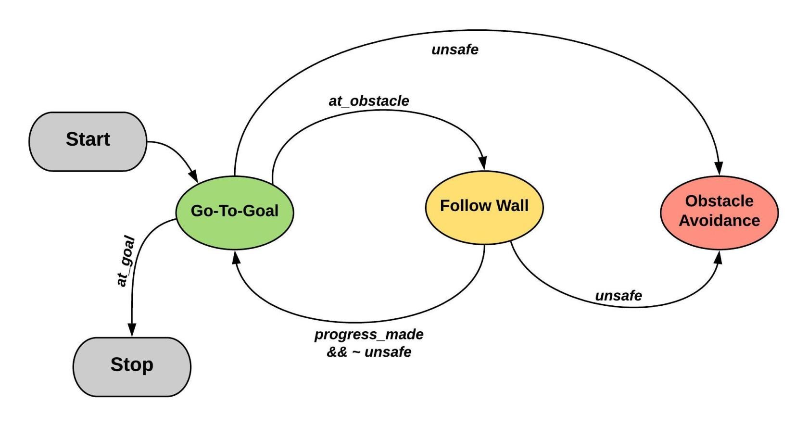

# Control of Differential Drive Robots
Coursera: Control of Mobile Robots

---

## Dependencies

* MATLAB 2015 or later
* GUI Layout Toolbox 2.3.1.mltbx

## Running the simulations

* Install the GUI Layout Toolbox 2.3.1mltbx file in MATLAB. 
* Run launch.m from any folder to launch simulation.

## Hybrid Automata

## For more information
https://avitech.blog/2016/01/09/ddrcontrol/

## Contributers
Avinash Sharma: avinashmnit30@gmail.com

## License and Copyright
© Avinash Sharma

